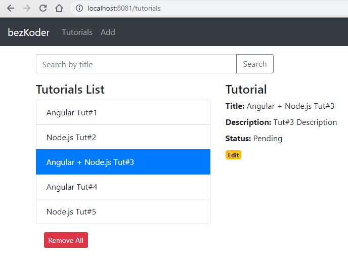

# Angular 16 Node.js Project: 





## Project setup

### Node.js Server
```
cd node-express-[database]-server
```
Run `node .`

### Angular Client
```
cd angular-16-client
```
Run `ng serve --port 8081`. Navigate to `http://localhost:8081/`.
